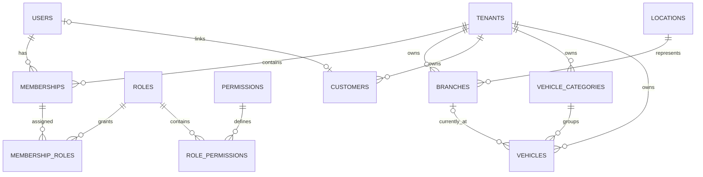
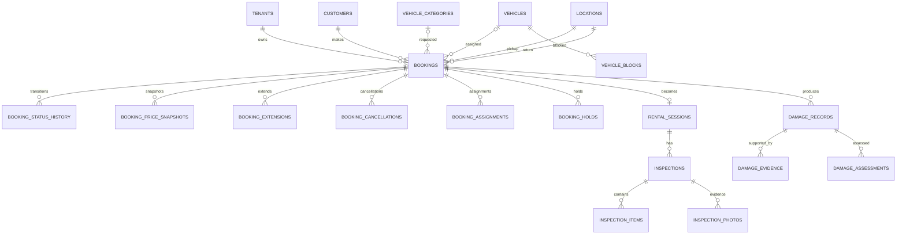
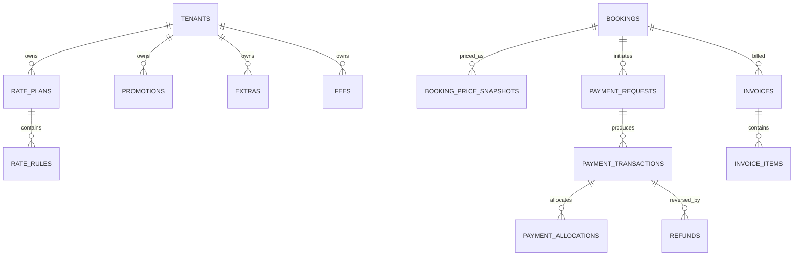
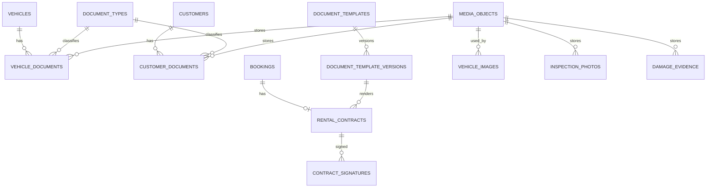
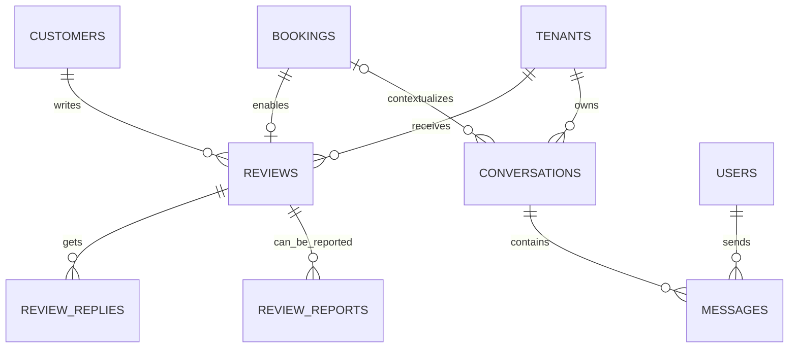
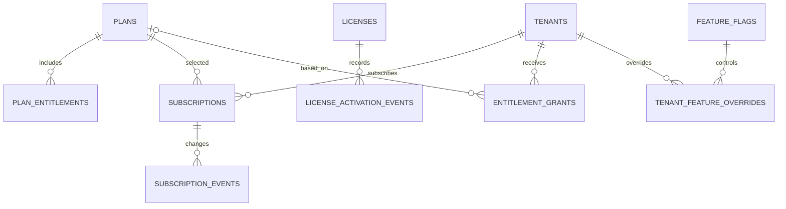

# ERD v1 — Core Relationship Map

Status: design baseline.

The diagram is intentionally split by domain. The full physical schema is defined in `database-schema-v1.md`.

## Core tenancy and identity

## Booking and fleet

## Pricing and payments

## Documents and media

## Marketplace trust and communication

## SaaS control plane

## Design invariants

1. All tenant-owned business data has an explicit tenant ownership path.
2. A booking belongs to exactly one tenant/agency.
3. A customer may be linked to a user account, but customer business data remains tenant-scoped.
4. Historical booking state, pricing, payment, contract and inspection evidence remains auditable.
5. Marketplace discovery can aggregate offers across tenants but must never merge agency ownership or expose private operational records.
6. SaaS control-plane data is isolated from agency operational data.
7. Spatial data is attached to canonical `locations`/`delivery_zones`, not duplicated in every consumer record.
